# VS CODE Basics
*VS code* or *Visual Studio Code* is a lightweight IDE. It works especially well.

1. Open up visual studio code by pressing windows button and typing in `Code`.
You are greeted by the previous environment you had open, or a new blank file
if there was none.
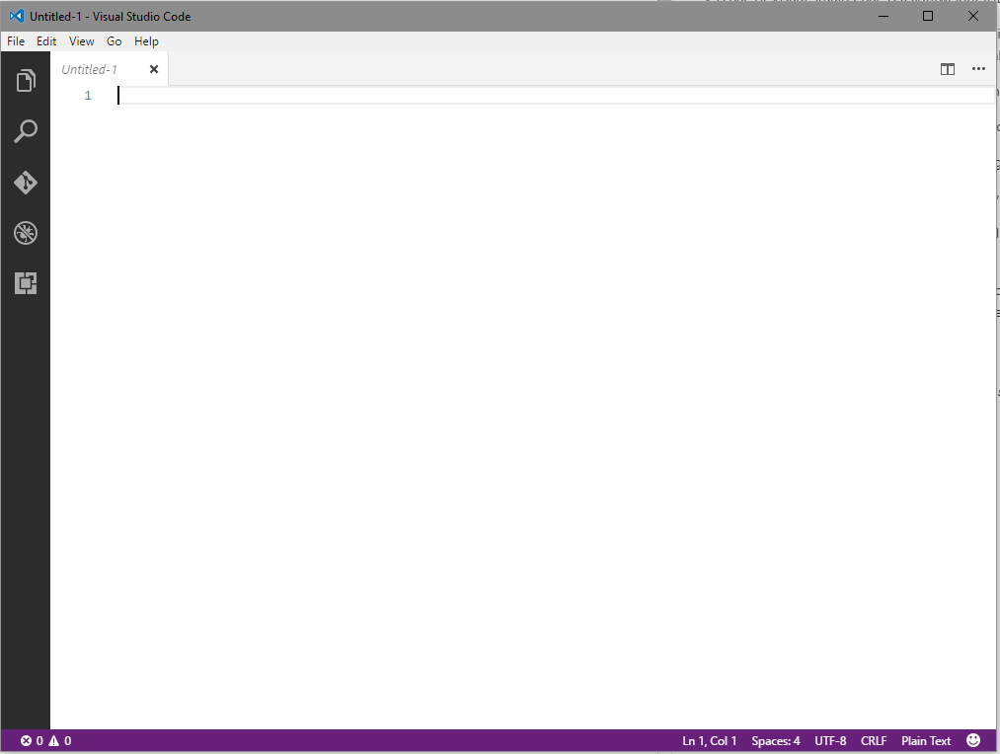

In any editor like this there are a myriad of commands and many keyboard shortcuts.
Furthermore keyboard shortcuts may be different between the different platforms. this
document will show the windows shortcuts but they may be different on Mac or Linux.
However, this is unimportant in light of the next feature.

2. The *Command Palette* may be shown by pressing <kbd>ctrl+shift+p</kbd>. On may
now search through and execute all VS Code commands by typings. It also shows
the keyboard shortcut next to the command.<br>
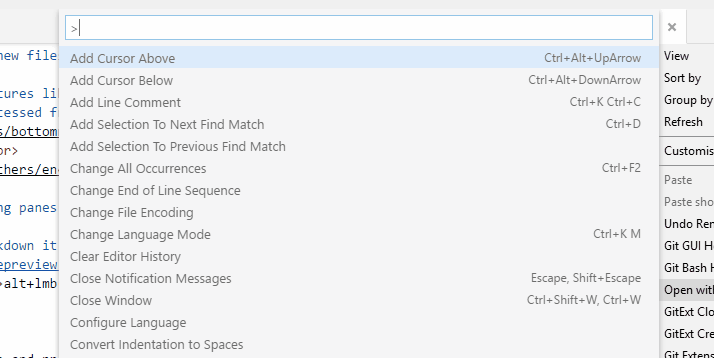

3. Just pressing <kbd>ctrl+p</kbd> or <kbd>f1</kbd> brings up *Quick Command*. In this mode typing
will search through and allow you to open files. But it also performs many other
functions. Pressing `@` searches through symbols in the file and `#` through
all files inthe workspace. Typing `ext` manages extensions. Typing `>` opens
the command palette.

4. Like any text editor new files may be opened or dragged in from explorer.

5. It has some nifty features like changing indentation, charset, syntax highlighting
etc. All these may be accessed from the bottom right corner of the editor:<br/>
<br>
e.g. changing encoding:<br>
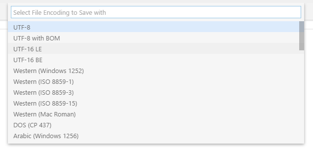

6. It has multiple editing panes and dragging the tab allows you to dock them.

7. For files such as markdown it has live preview.
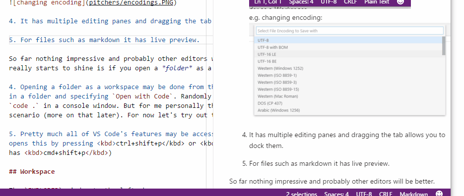<br>
Speaking of, if you <kbd>alt+lmb</kbd> you can put down multiple cursors ala-sublime.
Also <kbd>ctrl+alt+up</kbd> or <kbd>ctrl+alt+down</kbd> (windows).

## Workspace

So far nothing impressive and probably other editors will be better. Where VS Code
really starts to shine is if you open a *folder* as a *Workspace*

1. Opening a folder as a workspace may be done from the *File* menu
<br>
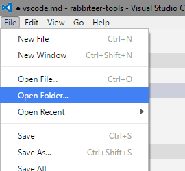<br>
or by right clicking in a folder and specifying `Open with Code`<br>
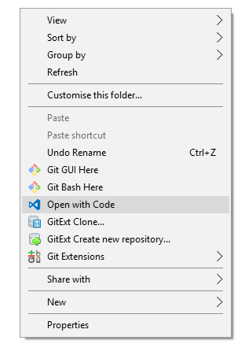<br>
Randomly it can also be openend by typing `code .` in a console window.<br>
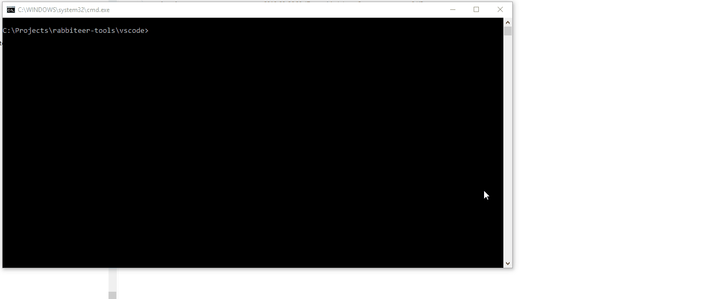<br>
For me personally the inverse is a much more likely scenario (more on that later).

2. And of course a folder may be opened via the command pallette.

Once VS Code is opened as a workspace, The `EXPLORER` window to the left shows the
folder structure (show/hide with <kbd>ctrl+b</kbd> focus with <kbd>ctrl+shift+e</kbd>),
and the other buttons on the tool panel start making sense. You can seach through
files, perform basic git functions, and even debug code (more on that later).

3. preview a file from the explorer by clicking it, clicking multiple files will cycle
through which one is being previewed. Double click to keep it open.

3. Switch between files by pressing <kbd>ctrl+tab</kbd> or move forward or backward
by pressing <kbd>alt+left</kbd> and <kbd>alt+right</kbd>. This counts even for
previewed files.

4. open a file in the second pane by <kbd>ctrl+lmb</kbd> on them.

## clone the project
Before we move on it may be helpful to clone the project if you haven't already.

1. Clone the project `https://github.com/RetroRabbit/rabbiteer-2016.git`

2. Open the folder for the project in VS Code.

3. Switch to the `vs-code` branch in the bottom left corner<br>
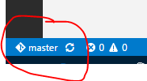<br>
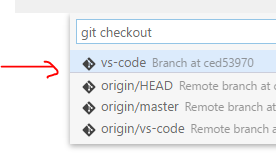

### Getting the project set up quickly

1. Press <kbd>ctrl+`</kbd> to open the integrated terminal window.<br>
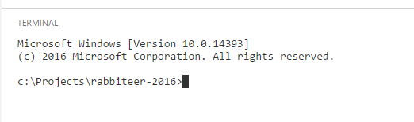<br>
You may also press <kbd>ctrl+shift+c</kbd> to open an external terminal window.

2. run `npm install`

While `npm install` is doing its thing, we can look at some other features.

## some more editor features

1. Go to a line by pressing <kbd>ctrl+g</kbd> or <kbd>ctrl+p</kbd> <kbd>:</kbd>

2. jump to matched bracket <kbd>ctrl+shift+\</kbd>

3. jump to symbol by pressing <kbd>ctrl+o</kbd> or `@` in quick command.

4. <kbd>ctrl+u</kbd> undos cursor pos.

5. VS Code automatically highligtes other occurences of selected text.

6.<kbd>ctrl+k ctrl+x</kbd> trims trailing whitespace

7. <kbd>ctrl+shift+f</kbd> formats selection or whole file.

8. <kbd>ctrl+shift+[</kbd> and <kbd>ctrl+shift+]</kbd> folds code.

9. <kbd>shift+alt+left</kbd> and <kbd>shift+alt+right</kbd> increase/decrease the selection
area.

10. <kbd>ctrl+i</kbd> selects the current line

## Snippets
For each language there are snippets available.

1. Snippet extensions may be installed, searching for "snippet" `ext install snippet`.
2. Your own snippets may be added too by going to `Open User Snippets`.<br>
The snippet source:<br>
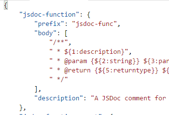<br>
And put it in javascript:<br>
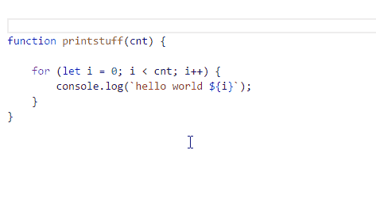

## git
VS Code has rudimentary but very helpful git support.

1. The git panel shows staged and unstaged files. It allows you to commit, push, pull, etc.

2. when you click on a file it will show a diff.
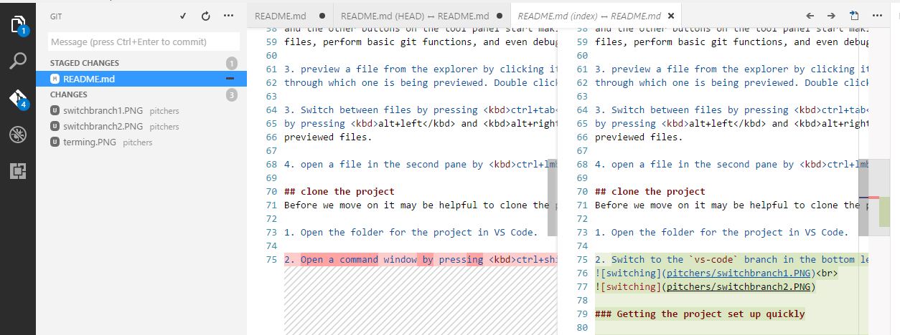

3. VS Code pereodically does a fetch in the background, downloading new commits. On the bottom
right corner, the number of incoming commits (commits that have been pushed by others and fetched)
and outgoing commits (your commits that have not yet been pushed).<br>
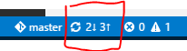

4. Clicking this button will merge and push, synchronizing your changes to the remote git repo.

5. VS Code can also help with conflicts.<br>
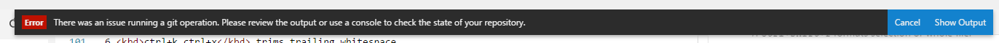<br>
A merge is needed:<br>
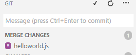<br>
Meging the file:<br>
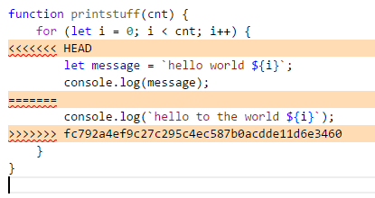

## Extensibility
VS Code is trememdnously extensible.

1. Settings may be changed for the current workspace or for all workspaces. Settings
are stored in a JSON file and autocomplete.

2. Keyboard shortcuts, color themes, and icon themes may also be customized. The latter
two may also be downloaded from the marketplace.

Speaking of which, there are several useful extensions to be found.

### ESLint
ESLint allows for linting of javascript files in your project. Linter errors will be
shown as errors/warnings in the bottom right corner and problems pane
<kbd>ctrl+shift+m</kbd>.

1. Install by running in the *Quick Command* typing `ext install vscode-eslint`

2. Remember to enable it. You will have to restart VS Code to enable it.

3. VS Code will now respect the `.eslintrc.yml` file and lint all our javascript!<br>
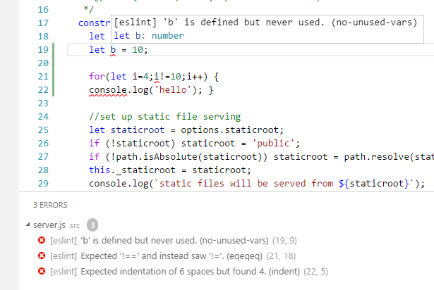
4. Hint: you may fix formatting problems by pressing <kbd>ctrl+shift+f</kbd>

### NPM
remember how we opened the terminal to run `npm install`? Why don't we just integrated
NPM directly into VS Code?

1. The NPM extension allows that.
2. After it is installed and enabled, npm commands will be available from the *Command
Palette*.
3. Try `npm start`. NPM will build and run and open in your web browser.<br>
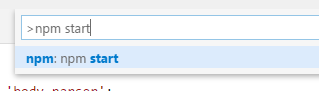<br>
Started:<br>
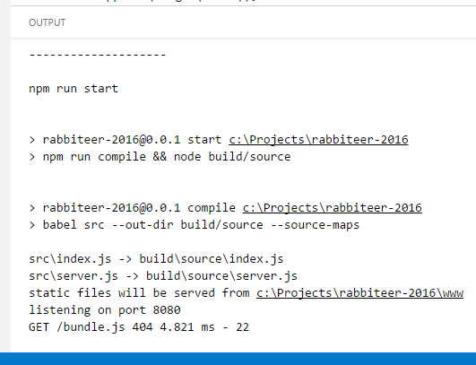
4. Stop again by typing `npm terminate`<br>
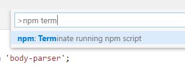<br>
and selecting the process it shows.<br>
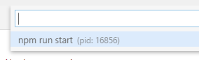<br>
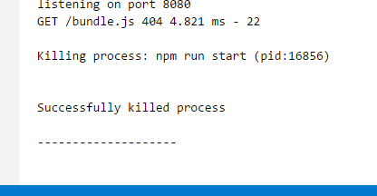<br>


### Slack

1. type `ext install Slack` in *Quick Command*
2. after enabling open user settings (<kbd>ctrl+shift+p</kbd> it man!)

### VS-Code Icons
Need some more Icons?

1. install `ext install vscode-icons`
2. File -> Preferences -> File Icon Theme and select it.

# Editing
Let's get cracking!

1. By now the project is cloned

## HTML editing

### emmet
Type an emmet snippet then press <kbd>tab</kbd> to magically insert a crapload of html.

Try these:

* `nav>ul>li`
* `ul>li*5`
* `ul>li.item$*5`
* `h$[title=item$]{Header $}*3`
* `html:5`
* `link:css`
* [cheatsheet](http://docs.emmet.io/cheat-sheet/)

## Javascript editing
The project uses javascript on the server (node.js) and client (angular).

1. VS Code will automatically know about javascript. The `jsconfig.json` file
lets it know that the project has javascript.

2. Editing javascript allows for rudimentary intellisense and formatting.

3. Of course linting is working as per the previous installation of the ESLint plugin.

## Javascript intellisense
So VS Code will by default pick up various intellisense for javascript. However, we
can make things *much* better.

1. We use a tool called *typings* to add better code completion for javascript. It is
designed for typescript, but VS Code will pick up the typings and autocomplete for
javascript as well.

2. We have sneakily installed typings along with all the other npm deps. We'll use that
now to add typings for the dependencies we use.

3. If we look inside the `package.json` file we see that there are basically
three dependencies: `express`, `body-parser`, and `opn`. So lets install
typings for those. Open a terminal window and type:
```
node_modules\.bin\typings install opn body-parser express --save
```

4. Now you'll have nice autocomplete for imported types. Open up `server.js` and mouse
over `let app = express()`.<br>
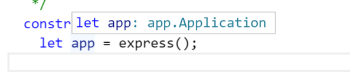<br>
You'll note it now shows that `app` has a type.

5. Now type `json()`. You'll note that it shows usage:<br>
<br>
And even shows documentation for the object that goes inside it!<br>
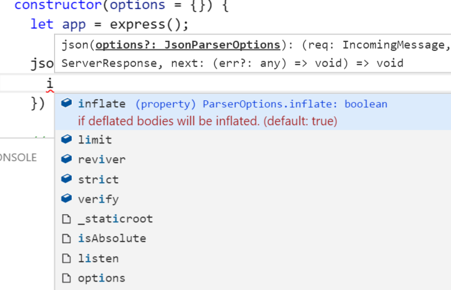<br>

6. Lastly, we'll want to add typings for *Node*. This is different
seeing as node is *global*. So we install typings like so:
```
node_modules\.bin\typings install env~node --global --save
```

### Spacing for js files
4. VS Code automatically picks up the space/tabs and amount of spaces (see bottom right).

5. However, if you create a new file, it will go back to 4 spaces. We can change this
default for our project.

6. Create a settings file by command palette-ing `Workspace Settings`.

7. The editor will open the default settings (left) and the workspace settings (right).
The workspace settings autocomplete so you can close the global dettings.

8. Set tab size to 2 spaces by adding `"editor.tabSize": 2`. Now if you create a new js
file it will default to 2 spaces.

### Tasks
You may have noticed that both server and clientside javascript needs to be compiled
and packed and whatnot. This is done by running `npm run build`.

However, it would be super convenient if we could just run and build and compile via
tasks in the command palette.

1. Let's configure a build task. Press <kbd>ctrl+shift+b</kbd>. That's the shortcut for
*build*. The editor will moan that it doesn't have a build task and allow you to create
one.

2. Create a task configuration for `npm` (note: even though we use gulp, we don't want
to be bound to it indefinitely, but we are using a node project so we might as well
use npm).

3. This will create a task configuration file with three tasks. To run a task press
<kbd>ctrl+p</kbd> and start typing `task `. It will autocomplete these three tasks.

4. Now we need to add a build task, so add a task that runs `npm run build` and call
it `build`. Also add a key for `isBuildCommand`.

5. Now if you press <kbd>ctrl+shift+b</kbd> it will compile all the various needed files.

### Launching
This may all seem a bit superflous in light of the npm extension, but the purpose will
become apparent once we want to start launching and debugging. What we *really* want
is to press a keyboard shortcut to build, launch, and debug the project. 

1. From the command palette, `Debug: Open launch.json` and select `node.js`. This will
create a launch configuration file.

2. It tries to pick up settings from package.json. These would work for a stock node
project, but we are using *Babel* to enable ES6 development, so we need to make a few
changes. (find attached launch.json)

3. Now if you press <kbd>f5</kbd>, the project will build and start debugging.

# Links
* I pilfered this: [https://github.com/Microsoft/vscode-tips-and-tricks](https://github.com/Microsoft/vscode-tips-and-tricks)
* Awesome extensions: [https://github.com/viatsko/awesome-vscode](https://github.com/viatsko/awesome-vscode)
* I pilfered this too: [https://code.visualstudio.com/docs/runtimes/nodejs](https://code.visualstudio.com/docs/runtimes/nodejs)
* Emmet cheat sheet: [http://docs.emmet.io/cheat-sheet/](http://docs.emmet.io/cheat-sheet/)